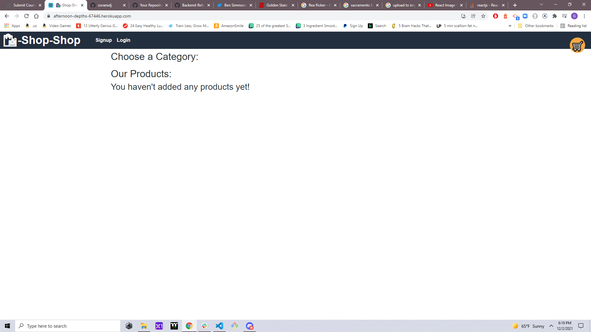

# Backend-Refactor

## Table of contents
​
- [General info](#General-Info)
- [Technologies](#Technologies)
- [Deployment](#Deployment)

​
## General-Info
​
This is an online store that ahs been refactored to use Redux instead of context based prop handling.
​
Deployed link: 
​
Landing page 
​

​
## Technologies
​
Project is created with:
​
- [React](https://reactjs.org/)
- [JavaScript](https://www.javascript.com/)
- [Bootstrap](https://getbootstrap.com/)
- [Node.js](https://nodejs.org/)
- [Express.js](https://expressjs.com/)
- [MongoDb](https://www.mongodb.com/)
- [Mongoose](https://mongoosejs.com/)

- note* this is a refactor and may contain unused code

​
## Deployment
​
Download the repository
​
- Copy the repo
- install dependencies 
- To run on browser: `npm run develop`
- You can also use the heroku-link for a demo:
- Deployed link: 

- hhttps://afternoon-depths-67446.herokuapp.com/
​
​
## Authors
​
- Gavin Murphy
​
## License
​
- Open Source